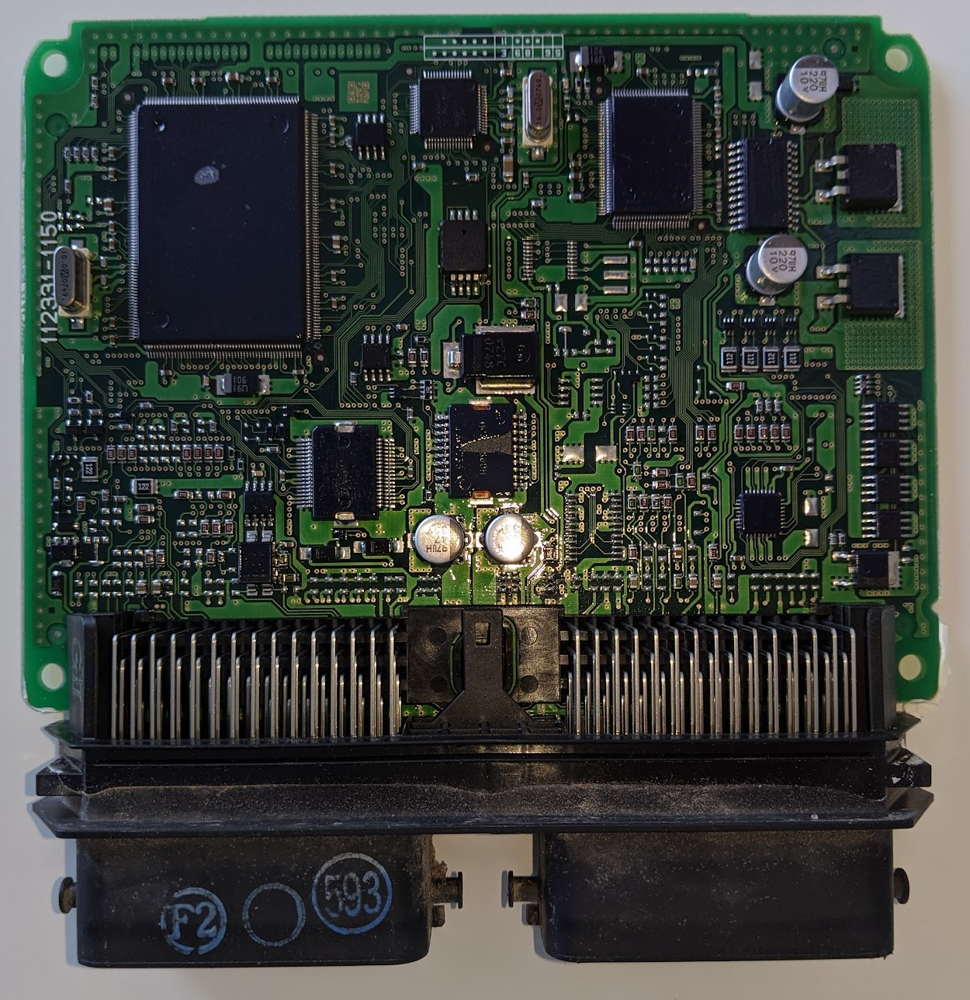
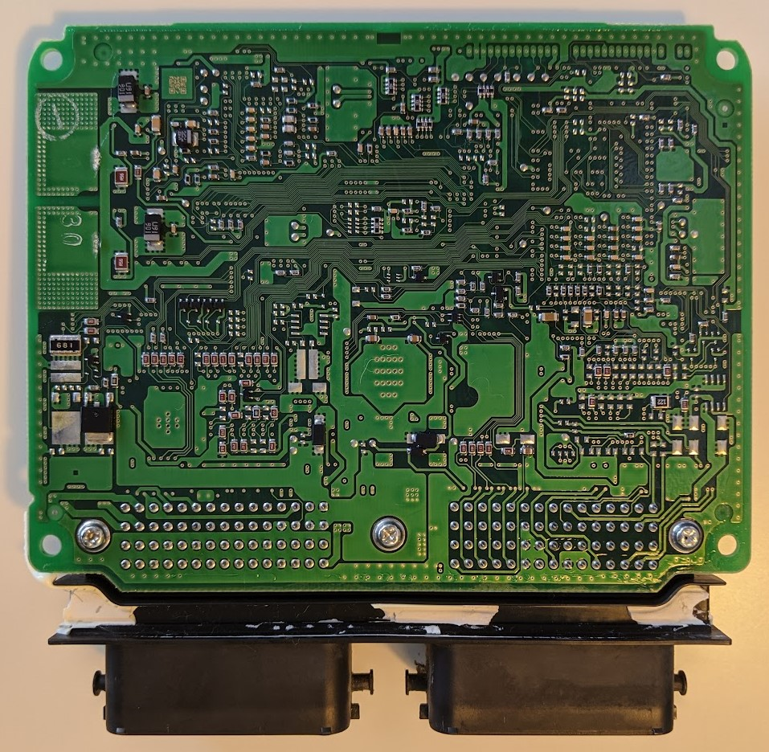
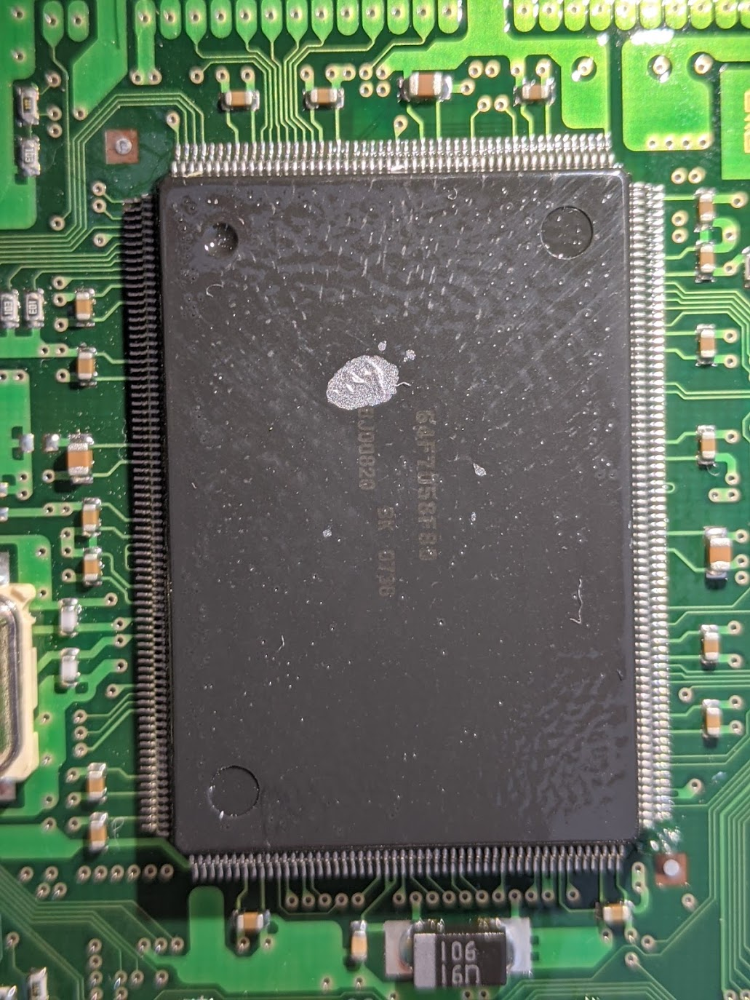

# Suzuki Grand Vitara 3G ECU reverse engineering

## 2.0L engine (aka JB420)
ECU part number is 33921-65J1

## How to read the ROM

1. Get a KESS V2 device
2. In their app, use Subaru's protocol 482 to read the rom

## How to set up Ghidra:

1. Download and install [Ghidra](https://github.com/NationalSecurityAgency/ghidra)
2. Open the binary dump
3. Add SH7058 config from [here](https://github.com/fenugrec/nissutils/blob/master/ghidra_helpers/README.md#using), (use the generic 7058 configs, not the Nissan specific ones).

## Other pointers

* Nisprog for reading/flashing Nissans - https://github.com/fenugrec/nisprog/blob/master/SubaruSIDs.txt
* Immo disable 
    * http://www.digital-kaos.co.uk/forums/showthread.php/168712-Suzuki-Grand-vitara-with-denso-ECU-finaly-started-by-removing-chip-from-ECU
    * https://forum.carlabimmo.com/viewtopic.php?t=19204
* Maps change - Use [ScoobyRom](https://github.com/dschultzca/ScoobyRom) to find maps definitons. These can be exported for use in RomRaider.
* https://nissanecu.miraheze.org/wiki/Tools
* https://evoscan.com/tech-articles/#Articles
* [Get started with IDA and disassembly SH7058](https://www.romraider.com/forum/viewtopic.php?f=25&t=6303)
* open port logging
   * http://forums.openecu.org/viewtopic.php?f=57&t=4319
   * https://www.evoxforums.com/threads/goldenevos-logcfg-txt-for-standalone-logging.68429/post-1229472
   * 
