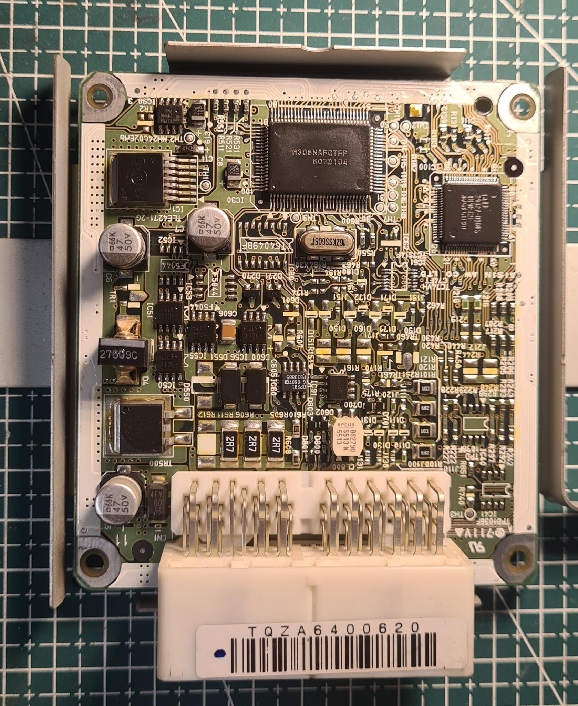

# Grand Vitara JB420 transmission

Transmission model name is `03-72LS`, which seem to be named `A44DF` in Toyota cars, [service manual](Aisin.pdf).

MCU is `M306NAFGTFP` by Renesas, [documentation](M306NAFGTFP.pdf).

